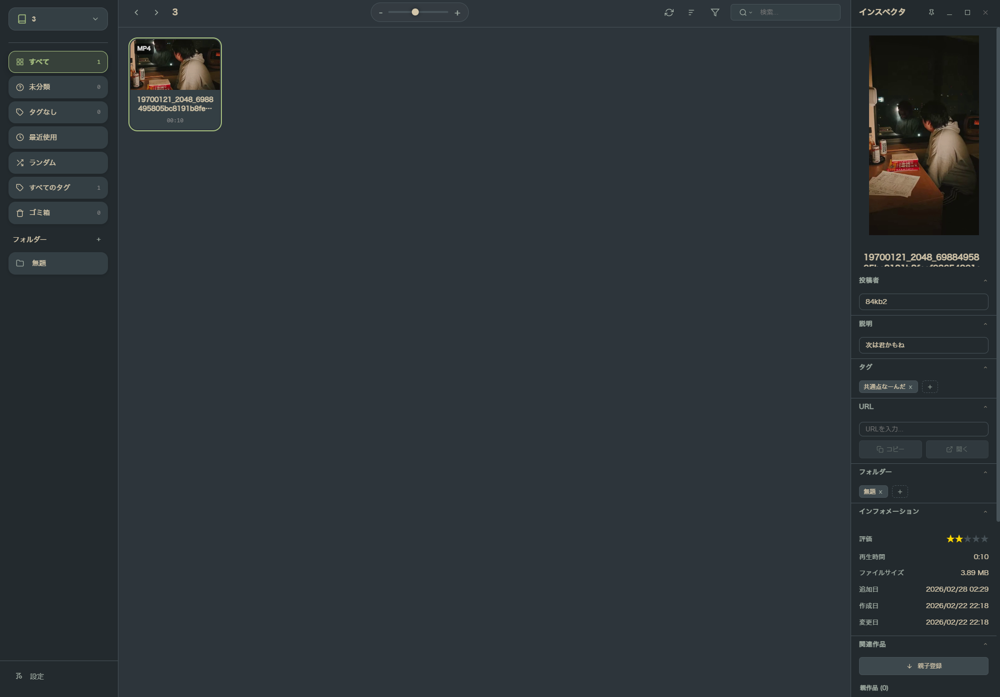

# Obscura

Eagleライクなライブラリ型メディアプレイヤーWindowsアプリケーション


## 概要

Obscuraは、動画・音声ファイルを美しく管理・再生できるデスクトップアプリケーションです。YouTubeホーム風のグリッドレイアウトで、大量のメディアファイルを直感的に閲覧・管理できます。

## 主な機能

- 📁 **ライブラリ管理**: フォルダを選択して自動的にメディアファイルをスキャン
- 🎬 **動画再生**: mp4, mkv, avi, mov, webm等の動画フォーマットに対応
- 🎵 **音声再生**: mp3, wav, flac, m4a, ogg等の音声フォーマットに対応
- 🎨 **モダンなUI**: ダークテーマの洗練されたデザイン
- 🔍 **検索・フィルター**: ファイル名検索とファイルタイプフィルター
- 💾 **データ永続化**: ライブラリ情報を自動保存
- 📝 **メタデータ参照**: yt-dlpやnico downloader等で取得したメタデータを参照

## スクリーンショット

<!--  -->
<!-- スクリーンショットを追加するには、./docs/screenshot.png に画像を配置し、上の行のコメントアウトを外してください -->

## 必要な環境

- Windows 10/11
- Node.js 18以上
- npm 9以上

## インストール

```bash
# リポジトリをクローン
git clone https://github.com/84kb/Obscura.git
cd Obscura

# 依存関係をインストール
npm install
```

## 使い方

詳細な操作説明書は [USER_GUIDE.md](./USER_GUIDE.md) にまとめています。

### 開発モードで起動

```bash
npm run electron:dev
```

### アプリケーションをビルド

```bash
npm run build
```

ビルドされたアプリケーションは `release` フォルダに出力されます。

## 対応フォーマット

### 動画
- `.mp4` - MPEG-4
- `.mkv` - Matroska
- `.avi` - Audio Video Interleave
- `.mov` - QuickTime
- `.webm` - WebM
- `.flv` - Flash Video
- `.wmv` - Windows Media Video

### 音声
- `.mp3` - MPEG Audio Layer 3
- `.wav` - Waveform Audio
- `.flac` - Free Lossless Audio Codec
- `.m4a` - MPEG-4 Audio
- `.ogg` - Ogg Vorbis
- `.aac` - Advanced Audio Coding
- `.wma` - Windows Media Audio

## プロジェクト構造

```
obscura/
├── electron/           # Electronメインプロセス
│   ├── main.ts        # アプリケーションエントリーポイント
│   ├── preload.ts     # IPC通信ブリッジ
│   └── database.ts    # データストレージ
├── src/               # Reactアプリケーション
│   ├── components/    # UIコンポーネント
│   ├── hooks/         # カスタムフック
│   ├── types/         # TypeScript型定義
│   └── styles/        # スタイルシート
├── package.json
├── vite.config.ts
└── tsconfig.json
```

## 技術スタック

- **Electron**: デスクトップアプリケーションフレームワーク
- **React**: UIライブラリ
- **TypeScript**: 型安全性
- **Vite**: ビルドツール
- **CSS**: カスタムデザインシステム


## ライセンス

MIT

## 作者

84kb
(Built with the help of Google Antigravity)

## 貢献

プルリクエストを歓迎します!大きな変更の場合は、まずissueを開いて変更内容を議論してください。
